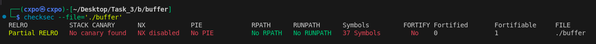
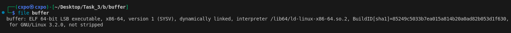
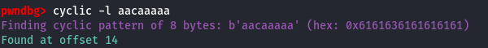
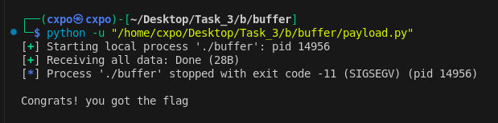

# Task 3

## [A) Brain Socket](./a)
## B) CTF
- [Binary](b/binary)
- [Forensics](b/forensics)
- [Web](b/sqli)
- [Reverse Engineering](b/reverse)
- [Crypto](b/crypto)

> __Note :__ Click on the topics for documentation.

# Binary Exploitation
- This exploitation works by buffer overflow vulnerability of `gets` function.
- Program is compiled with all the protections turned off.



- Program is 64bit executable and symbols are not stripped.



- Offset of RSP register (Stack Pointer) is found manually in `pwndbg`



- Payload is created using `pwntools` library and flag is fetched.



# Forensics
- `encoded.txt` file is encoded with `base64` and hidden inside [delta.jpeg](delta.jpeg) using `steghide`.
- Passphrase is `1234`

# Web (SQL Injection)
> __Environment :__ MySQL 8.2
- SQL Query in application :
```mysql
SELECT name FROM users WHERE uname = '$user' AND pass = '$pass'
```
- This is prone to injection. Application gets `name` from query and displays it on home page after successful login.
- Login for `admin` user can be bypassed by entering `admin' -- ` in the `username` field.
- With access to `information_schema`, list of tables can be obtained by `UNION` based injection.


- By knowing the name and number of columns, table data can be extracted. Number of columns can be calculated by `GROUP BY` method.


- By above methods, flag can be fetched.


- Images of Application : 


# Reverse Engineering
- Program gets input string, calculates the value and prints the flag if value matches to value hardcoded in program.
- Static Analysis using Ghidra (if the source code is not known) :


- Actual string used to print the flag is `capture the flag`


- Using `z3-solver`, string is found as `/;0[SS*$#9>{"; 7|n,C|]sa5` which also matches the value.


- By changing the length constraint, different strings which matches the value can be found. Found strings are : 
```
9@dQI**!>?w9l-i'-le`C!&zP
@SjA<*JF:Sjr|ci|vd5
,X%_oBt3yuu"w% 9?t!u"A
39#Vx_TJr1RX|%xt|~&
```

# Cryptography
- RSA is build using python.
- Message is encrypted with public key and decrypted with private key.
- Message is also signed and signature is verified.


